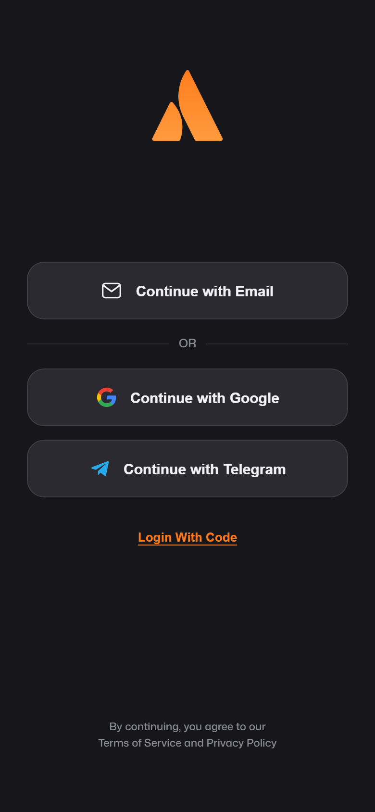

<div align="center">


# MetRix VPN

**Fast, secure, multi-protocol VPN for Android — built with Capacitor.**

[](https://github.com/zikzee632-hash/MetrixVPN/releases)
[](#)
[](#)

</div>

---

## Screenshots

<table>
<tr>
<td align="center" width="50%">
<br>
<sub>Splash</sub>
</td>
<td align="center" width="50%">
<br>
<sub>Sign in</sub>
</td>
</tr>
</table>

## What is MetRix VPN?

MetRix VPN is a hybrid Android app (Capacitor + native Android/Kotlin) that gives users a fast,
private connection with a choice of tunneling protocols and a real global server list, wrapped
in a modern dark-themed UI.

### Highlights

- **Multiple protocols** — OpenVPN (UDP/TCP), WireGuard, and **Mimic** (VLESS + REALITY, a
  censorship-resistant obfuscated protocol) with per-protocol server routing and live ping.
- **Global server list** with real pull-to-refresh, live latency, and city-level relays.
- **Flexible sign-in** — Email/OTP, Google, Telegram, or a cross-device **Login Code**.
- **Live network dashboard** — real IP/location lookup, upload/download stats, coordinates,
  network/ASN info.
- **Ad & tracker blocking** (NetGuard-style on-device filtering).
- **Home-screen widgets** (small/large, Jetpack Glance) and a Quick Settings tile for one-tap
  connect.
- **Self-updating** — in-app update checks resolve the correct build for the device's real
  CPU architecture (see below).
- **Dual-ABI builds** — every release ships both `arm64-v8a` (64-bit) and `armeabi-v7a`
  (32-bit) APKs, so older 32-bit devices get a build matched to their hardware (protocols that
  require a 64-bit native engine, like Mimic, are gracefully disabled rather than crashing).

## Tech stack

- **Shell:** [Capacitor](https://capacitorjs.com/) (Android)
- **UI:** single-page vanilla HTML/CSS/JS (`src/index.html`, `src/style.css`) — no framework,
  no bundler
- **Native layer:** Kotlin/Java plugins for VPN tunneling (OpenVPN3 core, WireGuard, mihomo/
  Clash.Meta for Mimic), widgets, update installation, and device bridging
- **Maps:** MapLibre GL
- **Updates:** GitHub Releases as the single source of truth for both the stable and
  pre-release (Dev Mode) update channels

## Getting started

```bash
npm install
npx cap add android
npx cap sync android
```

### Build the APK

Push to GitHub — CI builds automatically. Or build locally:

```bash
cd android && ./gradlew assembleOvpn23Release
```

This produces separate per-architecture APKs under
`android/app/build/outputs/apk/ovpn23/release/`:

- `app-ovpn23-arm64-v8a-release.apk` — 64-bit
- `app-ovpn23-armeabi-v7a-release.apk` — 32-bit

## Releases

Every release on the [Releases page](https://github.com/zikzee632-hash/MetrixVPN/releases)
ships both architecture builds:

| Asset | Architecture |
|---|---|
| `MetrixVPN-v<version>-arm64-v8a.apk` | 64-bit (arm64-v8a) |
| `MetrixVPN-v<version>-armeabi-v7a.apk` | 32-bit (armeabi-v7a) |

The in-app updater is architecture-aware — it always offers the device its matching build.

---

<div align="center">
<sub>© MetRix VPN</sub>
</div>
